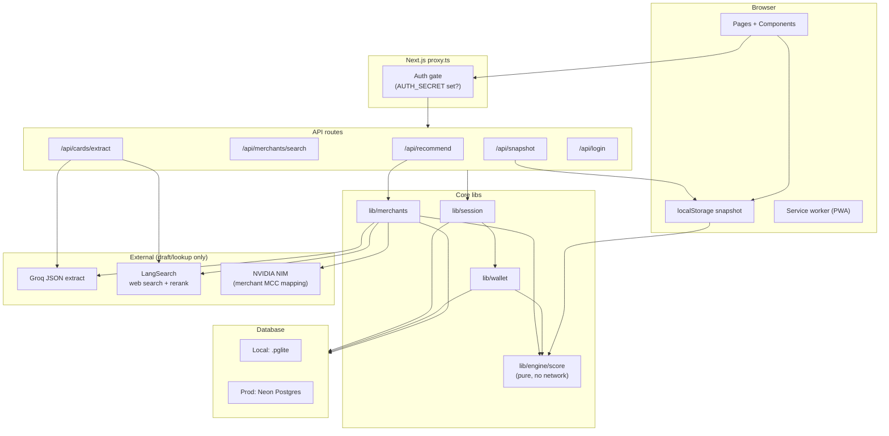
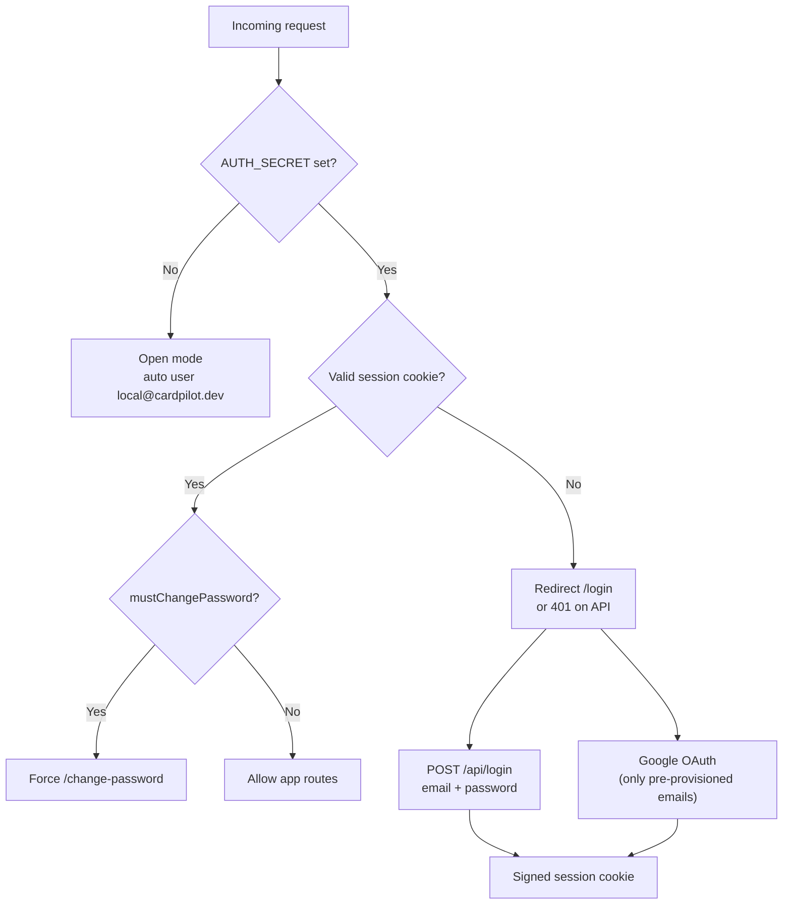
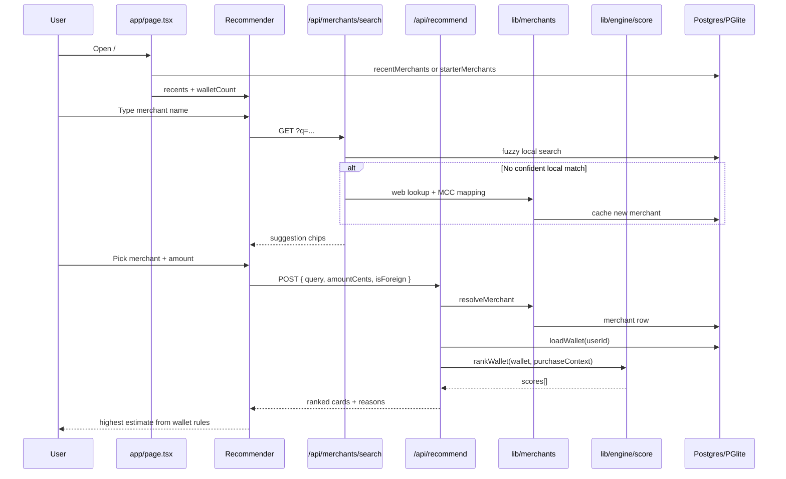
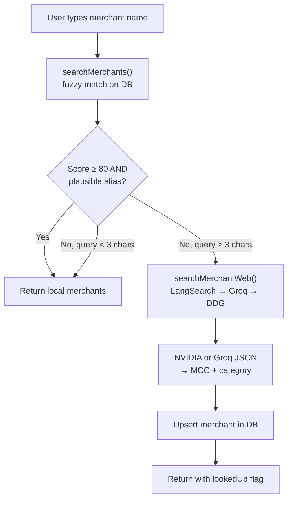
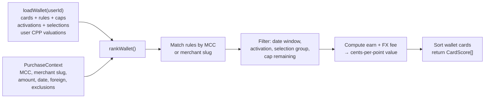
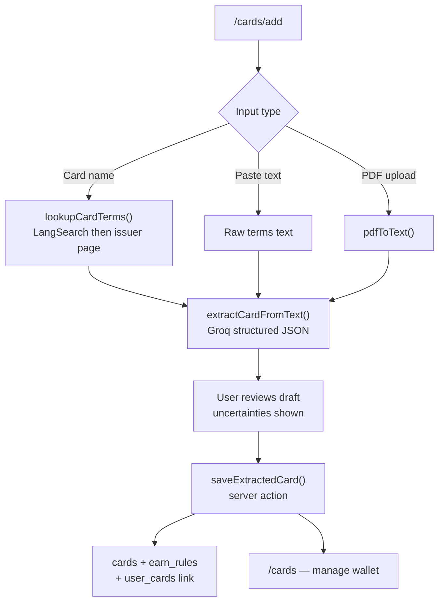
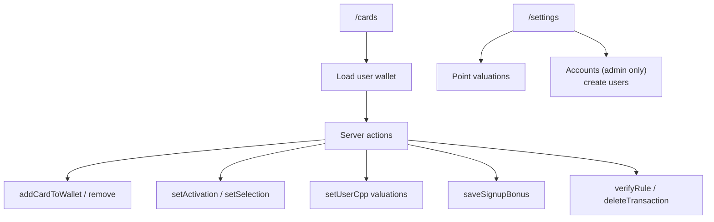
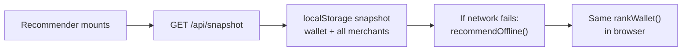
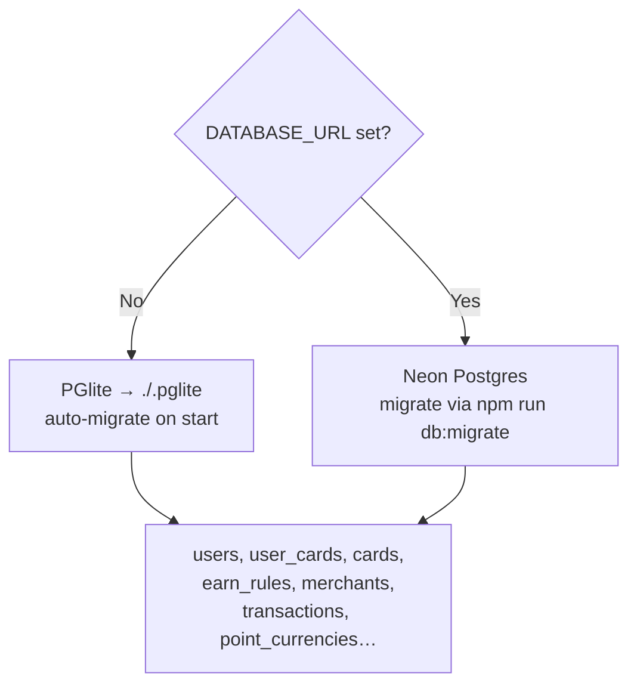
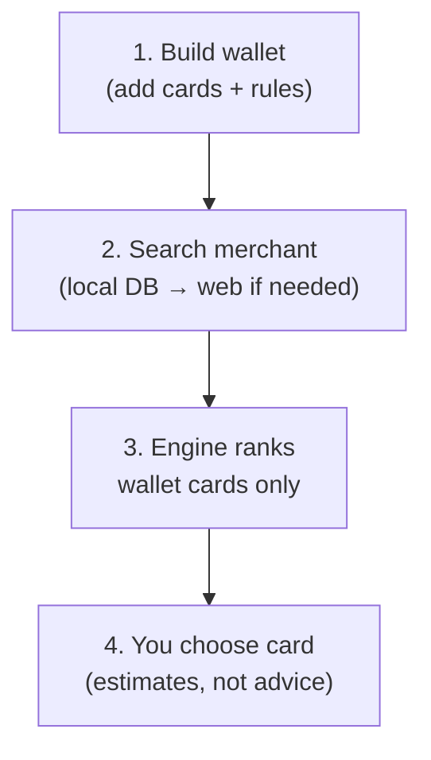

# CardPilot

Compare the cards in your wallet for a purchase using the earn rules you saved. The
arithmetic is shown so you can check it. Estimates only — not financial advice; confirm
rates with your issuer when it matters.

```
Compare at a purchase  →  "I'm at McDonald's"

McDonald's · MCC 5814 Fast food

    ┌──────────────────────────┐
    │ AMERICAN EXPRESS         │
    │ Gold Card                │
    │  7.2%                    │
    │  About $7.20 on $100.00  │
    └──────────────────────────┘

How this was calculated
Restaurants worldwide at 4x ......... 400 MR
400 MR at 1.8c each ................. $7.20
Bonus cap left this year .......... $49,900
  out of $50,000
```

## The one thing to do first

The Groq API key that was pasted into chat is in `.env.local`. Treat it as public and
[rotate it](https://console.groq.com/keys), then replace the value in `.env.local`.

## Running it

```bash
npm install
npm run dev
```

Open http://localhost:3000. There is no database to set up: with `DATABASE_URL` empty
the app runs [PGlite](https://pglite.dev), a real Postgres compiled to WebAssembly, storing
its data in `./.pglite`. It migrates and seeds itself on first request with eleven common US
cards and sixty merchants. Your wallet starts empty on purpose: a recommendation is only
useful if it names a card you can actually pull out, so nothing counts as yours until you
add it from the catalogue on the Wallet screen.

`npm run db:reset` deletes that local database so the next start rebuilds it. **Stop the dev
server before running any `db:` script.** PGlite is single-process, so a script and the server
cannot hold `./.pglite` at once, and doing it anyway leaves the running server reading an
empty database — every query returns nothing and pages start failing. If that happens, stop
the server, delete `.next`, and start again; a half-written dev cache serves 404s for routes
that plainly exist.

## How the decision is made

The winning card is **arithmetic, not a language model's opinion**. `lib/engine/score.ts` is
pure TypeScript with no database or network access, which is why it can be exercised
exhaustively in `lib/engine/score.test.ts`. It handles, in order:

1. Drop cards the merchant won't accept (Costco warehouses take Visa only).
2. Match the best earn rule by merchant category code, respecting validity windows,
   quarterly activation, and choose-your-category selections.
3. Split a purchase that straddles a bonus cap across the bonus and base rates.
4. Convert points to cash at *your* cents-per-point, which is the number that decides
   whether 4x Membership Rewards beats a flat 2% cashback card.
5. Subtract the foreign transaction fee when you're abroad.
6. Add the marginal value of an open signup bonus, which usually wins outright.

Web lookup and structured extraction are separate on purpose:

- **Web search** uses [LangSearch](https://github.com/langsearch-ai/langsearch) when `LANGSEARCH_API_KEY` is set (hybrid search, then semantic rerank). Groq `compound-mini` and DuckDuckGo lite are fallbacks.
- **Merchant MCC mapping** (`openai/gpt-oss-20b`, or NVIDIA NIM when configured) turns those snippets into a category code, then writes it to the `merchants` table. Each merchant costs one extraction call, ever.
- **Card lookup** fetches the issuer page from LangSearch (or Groq) URLs; `openai/gpt-oss-120b` extracts earn rules, which you review before anything is saved. Paste and PDF still work as a fallback when the issuer's site is a blank JavaScript shell.

Groq extraction uses `strict: true` JSON schemas so the shape is guaranteed by constrained decoding, and is validated again with Zod.

Neither is trusted blindly. A rule that comes back with no category codes would silently
never pay out, so `inferMccCodes` recovers them from the category name and the review screen
tells you it did.

## Architecture & flow

CardPilot is a Next.js app that ranks **cards in your wallet** for a purchase. Ranking is
deterministic (`lib/engine/score.ts`) — no LLM at purchase time. LLMs draft card rules or
resolve unknown merchants; you review before anything is saved.

### High-level architecture



### Auth & request gate

Every request passes through `proxy.ts`:



| Mode | When | Behavior |
| --- | --- | --- |
| **Local dev** | `AUTH_SECRET` empty | No login wall; `ensureDevUser()` creates `local@cardpilot.dev` |
| **Production** | `AUTH_SECRET` set | Admin-provisioned accounts only (`npm run user:create` or Settings → Accounts) |

Each user gets their **own wallet** (`user_cards.user_id`).

### Main user journey — “Which card here?”

Homepage flow (`/` → `Recommender`):



Suggestions rank **wallet cards only** — never the full catalogue as if you own them.

### Merchant resolution (local vs web)



Used by both **search autocomplete** and **recommend**.

### Ranking engine (pure, deterministic)



No network, no DB inside `lib/engine/`.

### Add cards to wallet



User must **review and save** — nothing is written blindly from model output.

### Wallet & settings



### Offline / PWA path



Snapshot is refreshed on load; ranking logic is shared between server and client.

### Data layer



### Routes at a glance

| Route | Purpose |
| --- | --- |
| `/` | Merchant search + card ranking |
| `/cards` | Your wallet |
| `/cards/add` | Extract/add card rules |
| `/settings` | Valuations + admin accounts |
| `/login`, `/change-password` | Auth (when enabled) |
| `/api/recommend` | Rank wallet for a purchase |
| `/api/merchants/search` | Autocomplete + web lookup |
| `/api/snapshot` | Offline wallet + merchant cache |
| `/api/cards/extract` | LLM card-rule extraction |

### End-to-end mental model



## Offline

The engine runs in the browser too. `/api/snapshot` returns your wallet, its rules, and
current cap usage; the client keeps that in `localStorage` and ranks cards locally when a
request fails. A service worker caches the shell so the app still opens. Recommendations work
in a supermarket basement; logging a purchase waits until you reconnect.

The service worker is registered in production builds only, so it can't serve stale bundles
during development. It is served from `app/sw.js/route.ts` rather than `public/` so that
development can return a worker which unregisters itself: running `npm start` once on
localhost otherwise leaves a worker controlling port 3000 that keeps intercepting `npm run
dev` afterwards, serving chunks the dev server no longer builds.

Add it to your home screen and it opens without browser chrome. Android reads the icon from
the manifest; iOS ignores the manifest and needs a raster `apple-touch-icon`, which
`app/apple-icon.tsx` renders at build time from the same artwork.

## Accuracy

The seeded cards were entered from publicly published terms and are **not** continuously
verified. Rotating quarterly categories are deliberate placeholders marked unverified, and
they show a warning wherever they'd win. Confirm anything that matters with your issuer, and
use **Add a card** to look the current terms up again.

Bonus caps are treated as calendar month, quarter, and year windows. Some issuers reset on
your cardmember year or statement cycle instead, so Settings lets you remove logged purchases
to correct cap tracking.

## Deploying

1. Create a Neon Postgres database (the Vercel integration does this in one step) and copy
   its pooled connection string.
2. Set these environment variables in Vercel:

   | Variable | Purpose |
   | --- | --- |
   | `DATABASE_URL` | Neon connection string. Its presence switches the app off PGlite. |
   | `GROQ_API_KEY` | Your rotated key. |
   | `LANGSEARCH_API_KEY` | Optional. [LangSearch](https://langsearch.com/api-keys) web search + rerank for unknown merchants and card lookup. |
   | `AUTH_SECRET` | Signs session cookies and turns the sign-in gate on. |
   | `GOOGLE_CLIENT_ID` / `GOOGLE_CLIENT_SECRET` | Optional Google sign-in. |
   | `GOOGLE_ALLOWED_EMAILS` | Optional extra Google restriction (users table is still required). |

3. Apply the schema and load the starter data against Neon:

   ```bash
   DATABASE_URL="postgres://..." npm run db:migrate
   DATABASE_URL="postgres://..." npm run db:seed
   DATABASE_URL="postgres://..." npm run user:create -- --email you@example.com --password 'temp-pass' --admin
   ```

4. Deploy. Sign in with the admin email, change the temporary password, then create other users from Settings.
## Signing in

Accounts are **admin-provisioned** — there is no public self-registration.

1. Set `AUTH_SECRET` (required in production).
2. Create the first admin:

   ```bash
   DATABASE_URL="postgres://..." npm run user:create -- --email you@example.com --password 'temp-pass' --admin
   ```

3. Sign in with that email and temporary password, then set a new password when prompted.
4. Admins can create more users under **Settings → Accounts**, or with the same CLI.

**Google (optional).** Set `GOOGLE_CLIENT_ID` and `GOOGLE_CLIENT_SECRET`. Register the redirect URI:

```
http://localhost:3000/api/auth/google/callback
https://your-domain.vercel.app/api/auth/google/callback
```

Google only works for emails that already exist as users. Optional `GOOGLE_ALLOWED_EMAILS` further restricts Google (not email/password).

Each user has a private wallet; the card catalogue is shared.
`GOOGLE_ALLOWED_EMAILS` is not optional. "Sign in with Google" on its own means *anyone with a
Google account*, so the allowlist is what makes it yours; an empty list refuses everyone rather
than admitting everyone. It is also re-checked on every request, so removing an address
immediately invalidates that person's existing session rather than waiting for it to expire.

The flow uses PKCE and a `state` parameter, both held in short-lived cookies, so a callback that
this app did not initiate is rejected. The ID token's signature is not checked against Google's
public keys because it is read from the token endpoint's response over TLS, authenticated with
the client secret, which OpenID Connect
[considers sufficient](https://openid.net/specs/openid-connect-core-1_0.html#IDTokenValidation);
its issuer, audience, expiry, and `email_verified` claims are all still enforced.

Against Neon, migrations are applied only by `db:migrate`, never at request time, so a cold
serverless invocation can't race to alter the schema.

## Scripts

| Command | What it does |
| --- | --- |
| `npm run dev` | Development server |
| `npm test` | Engine and matching unit tests |
| `npm run db:generate` | Regenerate SQL migrations after editing `db/schema.ts` |
| `npm run db:migrate` | Apply migrations to PGlite or Neon |
| `npm run db:seed` | Wipe and reload the starter cards and merchants |
| `npm run db:reset` | Delete the local PGlite database |

## Layout

```
app/            Routes, API handlers, and server actions
components/     UI, all mobile-first
db/             Drizzle schema, migrations, and seed data
lib/engine/     The rules engine and its tests — the part that must be right
lib/            Merchant matching, extraction, wallet loading, offline snapshot
proxy.ts        The single-password gate
```

`app/globals.css` lists its Tailwind sources explicitly with `source(none)` and `@source`.
Automatic detection scans the whole project, including the PGlite data directory and any
image you happen to leave lying around; binary bytes there parse as arbitrary-value
utilities such as `w-[…]` and emit CSS that fails to build, which takes every page down at
once. Add a directory to that list if you start keeping components somewhere new.

## Deliberately not done

- **Fine-tuning.** Groq has no self-serve fine-tuning, and a fine-tuned model would
  hallucinate reward rates while going stale every quarter that categories rotate. Reward
  rates belong in a database, not in weights.
- **Scraping issuer sites.** Cloudflare, PDF-only terms, and terms-of-service restrictions
  make it the flakiest possible foundation. Paste-and-confirm gets the same leverage with a
  human check.
